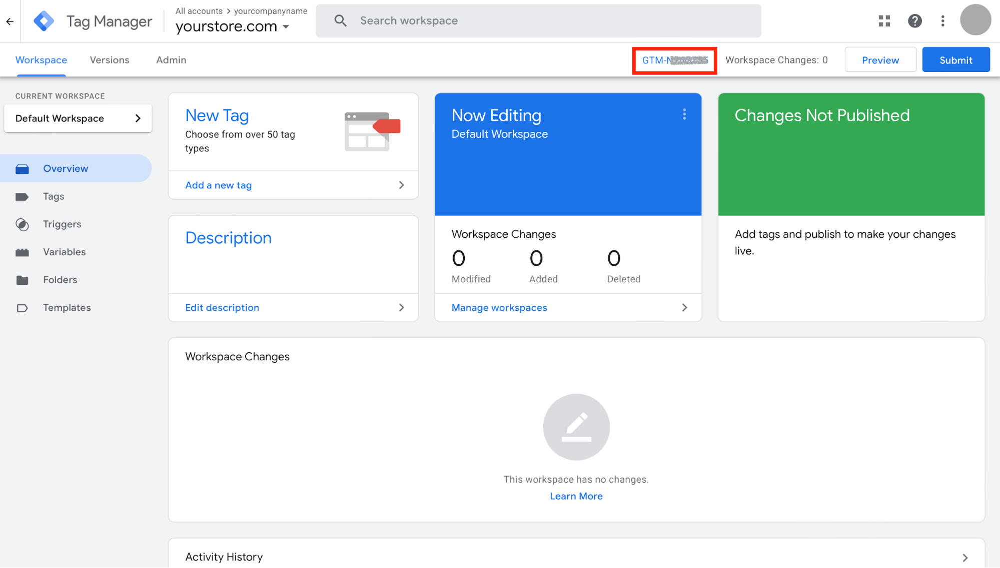

# Google Tag Manager Integration

[Google Tag Manager (GTM)](https://tagmanager.google.com/) is a powerful tool that allows you to manage and deploy various tracking codes, including those for marketing and analytics, on your store.

eCommerce allows you to effortlessly connect your store without the need for manual coding.

After adding a tag in Google Tag Manager to your eCommerce store, you will be able to track and collect valuable data about user interactions, website performance, and conversion events.

## Google Tag Manager Benefits

With Google Tag Manager (GTM), you can easily add tags to your online store without touching any code. By using tags and triggers in GTM, you can track customer behavior and analyze popular products and conversion funnels in your online store. You can monitor events such as page views, clicks, scrolls, adding or removing items from the shopping cart, and more.

### Centralized Tag Management

GTM provides a centralized platform for managing various marketing tags and tracking codes. Instead of manually editing code on your store, GTM allows you to add, modify, and deploy tags through its user-friendly interface.

### Comprehensive Tracking

GTM enables you to track and measure various user interactions on your online store. You can set up events, track conversions, monitor engagement metrics, and gain valuable insights into user behavior. This data-driven approach helps you optimize your marketing campaigns, understand customer preferences, and make informed decisions to improve your store's performance.

### Flexibility and Experimentation

You can add or remove tags, adjust tracking configurations, and even perform A/B testing, all within the GTM interface. This flexibility allows you to adapt your marketing strategies, experiment with different tools, and respond promptly to evolving business needs. GTM supports various tags, including Google Analytics, Ads, third-party platforms like Facebook, Twitter, Pinterest, and also custom tags.

### Quality Assurance

GTM also provides a preview mode, allowing you to test and validate your tags before deploying them live. These features ensure a smooth and error-free implementation of tracking codes, reducing the risk of data inaccuracies or disruptions.

## Connect Google Tag Manager to Your eCommerce Store

To connect [Google Tag Manager](https://tagmanager.google.com/) to your eCommerce store, you need to create a Google Tag Manager account. If you don't have a GTM account, follow the steps in the [Create GTM Account and Your Store Container](#create-gtm-account-and-your-store-container) section below.

If you already have a Google Tag Manager account and a container for your eCommerce store, follow these steps to connect it with your store:

1. On your eCommerce **admin panel**, navigate to ***Settings → Integrations***
2. Click on the **Connect** button for Google Tag Manager
3. Click on the **Add** button for Google Tag Manager
4. On this page, paste your **Container ID**. You can find the Container ID from your [GTM account](https://tagmanager.google.com/), identified as *GTM-XXXXXX* on the upper side of the page
5. Click **Submit**

Done! You've connected your GTM container to your eCommerce store.

With Google Tag Manager, you gain the ability to easily create and manage tags within your account. Any tags you create in GTM will seamlessly be added to your online store, without requiring any actions on the eCommerce admin panel.

## Create GTM Account and Your Store Container

1. Log in to your [Google Account](https://accounts.google.com/) or register for a new Google/Gmail account
2. Go to [https://tagmanager.google.com/](https://tagmanager.google.com/)
3. Click the **Create Account** button
4. Provide your **Account Name** and **choose your country**
5. Add the **Container name** to create a new container for your store
6. Select **Web** as the target platform
7. Click the **Create** button
8. Accept the Google Tag Manager Terms of Service Agreement

At the upper section of the page, you can see the Container ID identified as *GTM-XXXXXX*.

## Verify that Google Tag Manager is Installed

You can use the [Preview Mode](https://support.google.com/tagmanager/answer/6107056?) on the upper right part of Google Tag Manager, or the [Google Tag Assistant](https://get.google.com/tagassistant/) Chrome Extension to confirm that you've installed GTM properly.

## Common Tags to Implement

After connecting GTM to your eCommerce store, you might want to add these common tags:

### Analytics Tags
- Google Analytics 4 configuration tag
- Event tags (page view, scroll depth, outbound links)
- Ecommerce tracking tags (view item, add to cart, begin checkout, purchase)

### Marketing Tags
- Google Ads conversion tracking
- Facebook Pixel
- TikTok Pixel
- Pinterest Tag
- LinkedIn Insight Tag

### User Experience Tags
- Hotjar tracking code
- Crazy Egg tracking code
- Custom event listeners

### SEO and Site Performance Tags
- Google Search Console verification
- Site speed monitoring scripts

## Best Practices for Google Tag Manager

1. **Use a naming convention**: Develop a consistent naming system for your tags, triggers, and variables
2. **Create a testing environment**: Use preview mode to test tags before publishing
3. **Document your implementation**: Keep records of what each tag does and why it was implemented
4. **Audit regularly**: Periodically review your tags to remove any that are no longer needed
5. **Use folders**: Organize your tags, triggers, and variables into logical folders
6. **Implement data layer**: Use the data layer for enhanced tracking capabilities
7. **Set up user permissions**: Control who can view, edit, and publish changes
8. **Use built-in templates**: Leverage GTM's built-in tag templates when possible
9. **Monitor errors**: Regularly check for implementation errors in the GTM interface

By following these best practices and leveraging the full capabilities of Google Tag Manager, you can gain valuable insights into your customers' behavior and optimize your marketing strategies for better results.
