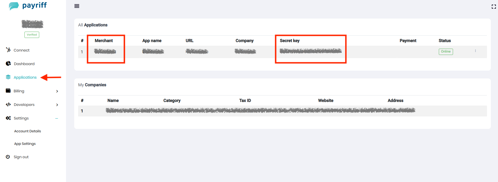

# Payriff Overview

Payriff is a payment solution for online transactions that is supported in Azerbaijan.

## How to Set Up Payriff

1. **Log in** to your eCommerce admin panel
2. Navigate to the ***Settings → Payments*** in your admin panel
3. Click on the "**Add payment method**" anchor text
4. If available with your store currency, select "**Payriff**" as your payment provider (if not available, see the [Payriff isn't available with your store currency](#payriff-isnt-available-with-your-store-currency) section below)
5. In the "**Enable payment method**" section, click on the toggle to enable the payment method
6. Enter the "**Public Key**" and "**Secret Key**" from your Payriff account, then click on the **Submit** button

### Accessing Your Public Key and Secret Key

To access your Public Key (named Merchant on Payriff's admin panel) and Secret Key:

1. Make sure you've created your merchant account on Payriff
2. Login to your Payriff account
3. Go to the "**Applications**" from the left menu
4. Here, you'll see the Public Key (under the Merchant column) and Secret key

### Enable Sandbox Mode for Testing

You can also enable the Sandbox mode to test the keys:

1. Click on the **More options** on the same page, and click on the toggle to enable the Sandbox mode
2. Write down the same keys to the "**Test Secret key**" and "**Test Public key**" input boxes to test the Payriff payment method at the checkout

## Payriff Supported Currencies

Currently, Payriff supports three currencies: Azerbaijani Manat, United States Dollar, and Euro.

| **CURRENCY NAME** | **CURRENCY CODE** |
|-------------------|-------------------|
| Azerbaijani Manat | AZN |
| United States Dollar | USD |
| Euro | EUR |

## Payriff Isn't Available with Your Store Currency

If Payriff payment isn't available due to your store currency, you cannot select this payment provider. To resolve this issue, you need to change your store's currency to one that Payriff supports.

To change your store's currency:

1. Head to the ***Settings → General*** in your eCommerce admin panel
2. Click on the "**Standards and formats**" settings
3. From the Currency dropdown menu, select the currency that Payriff supports
4. Click **Save**

:::caution
If you've already received an order for your online store, you cannot change the currency through the settings. In such cases, please contact eCommerce support (support@eCommerce.com) to request a change in your store currency.
:::

## Key Features of Payriff

### Azerbaijan-Focused Payment Solution

Payriff offers specialized features for the Azerbaijani market:

- **Local Currency Processing**: Support for Azerbaijani Manat (AZN)
- **International Currencies**: Additional support for USD and EUR
- **Azerbaijani Banking Integration**: Integration with local banking systems
- **Localized Experience**: Interface and support in Azerbaijani
- **Domestic Compliance**: Adherence to local regulations

### Payment Methods

Payriff supports several payment methods:

- **Credit Cards**: Major credit and debit cards
- **Local Payment Methods**: Options popular in Azerbaijan
- **Online Banking**: Integration with Azerbaijani banks
- **International Payments**: Process payments from global customers
- **Alternative Payment Methods**: Additional local options

### Business Tools

Beyond payment processing, Payriff offers:

- **Merchant Dashboard**: Track transactions and manage settings
- **Transaction Reports**: View detailed payment information
- **API Integration**: Connect with your existing systems
- **Security Features**: Protection against fraud and unauthorized transactions
- **Customer Support**: Assistance in Azerbaijani and English

## Best Practices for Using Payriff

1. **Set correct currency**: Ensure your store currency matches one of Payriff's supported currencies
2. **Test thoroughly**: Use sandbox mode to test before going live
3. **Keep credentials secure**: Never expose your secret key in client-side code
4. **Implement proper error handling**: Handle payment errors gracefully
5. **Verify transactions**: Always confirm payment status before fulfilling orders
6. **Display payment logos**: Show Payriff and accepted payment methods on your site
7. **Consider local preferences**: Offer payment methods popular in Azerbaijan if targeting that market
8. **Monitor transactions**: Regularly check your Payriff dashboard
9. **Update integration**: Keep your integration up to date with the latest Payriff API
10. **Provide multi-language support**: Consider offering Azerbaijani if targeting that market

## Troubleshooting Common Issues

When using Payriff, you might encounter these common issues:

### Integration Problems
- Incorrect API keys
- Unsupported currency
- Invalid checkout configuration

### Payment Failures
- Card declined
- Authentication failure
- Insufficient funds
- Card restrictions
- Expired card

### Technical Issues
- Network connectivity problems
- Webhook configuration errors
- Server timeout issues
- Browser compatibility problems
- SSL certificate issues

For technical support with your Payriff integration, contact Payriff support or visit the Payriff website.

## Security Considerations

Payriff maintains security standards to protect transactions:

- **Secure Transaction Processing**: All payments are processed securely
- **Data Encryption**: Customer and payment data is encrypted
- **PCI Compliance**: Adherence to Payment Card Industry standards
- **Fraud Detection**: Systems to identify and prevent fraudulent transactions
- **Transaction Verification**: Multiple layers of verification for payments

By properly configuring Payriff for your eCommerce store, you can provide your customers with a secure and convenient payment experience, particularly if you're targeting customers in Azerbaijan.
