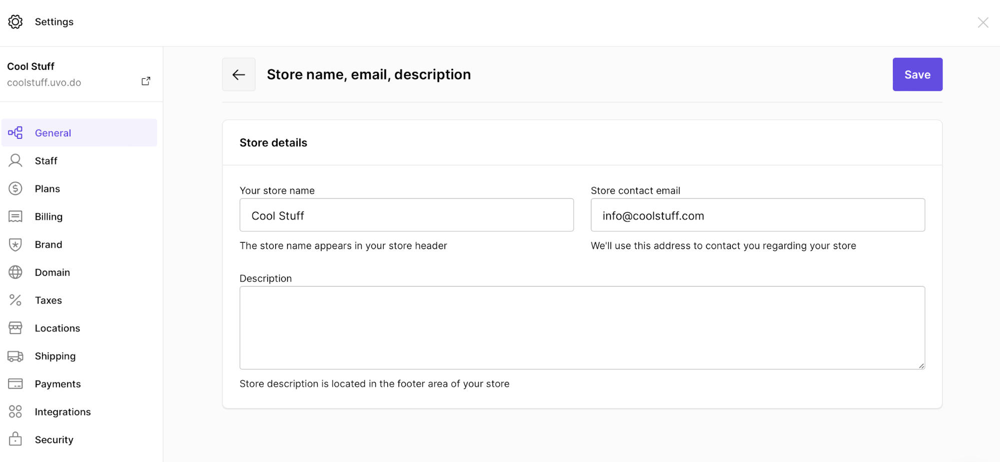
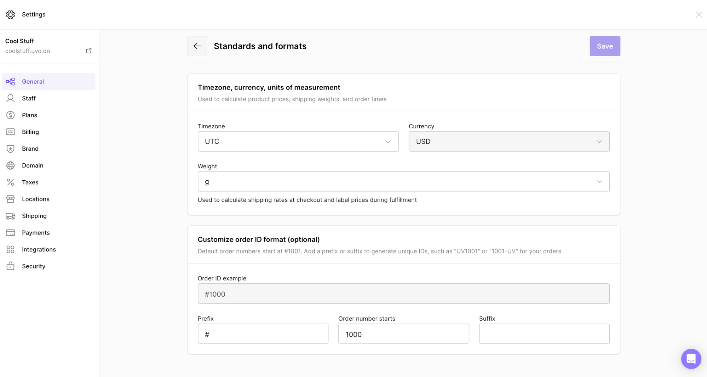
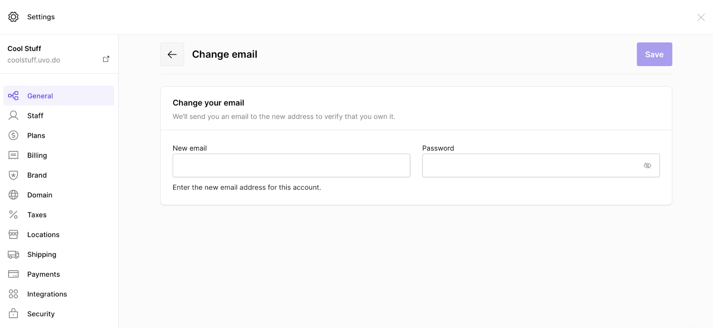
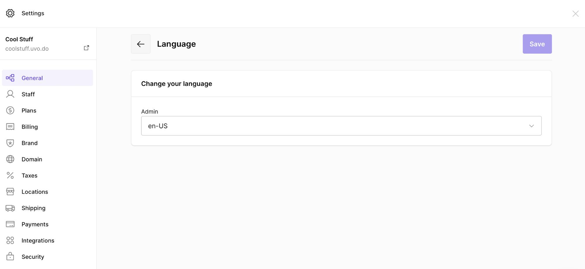
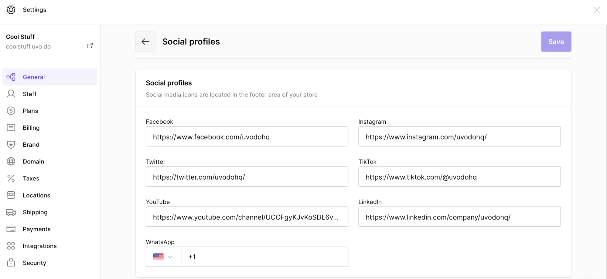
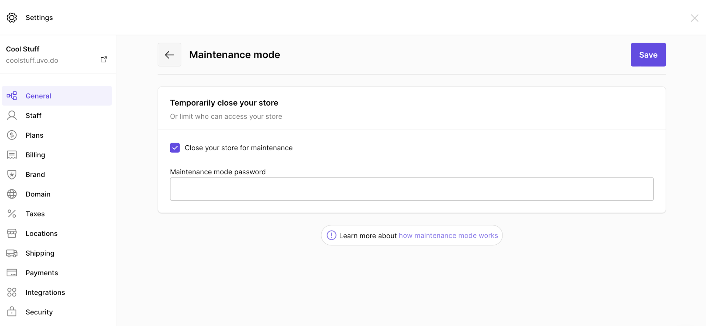
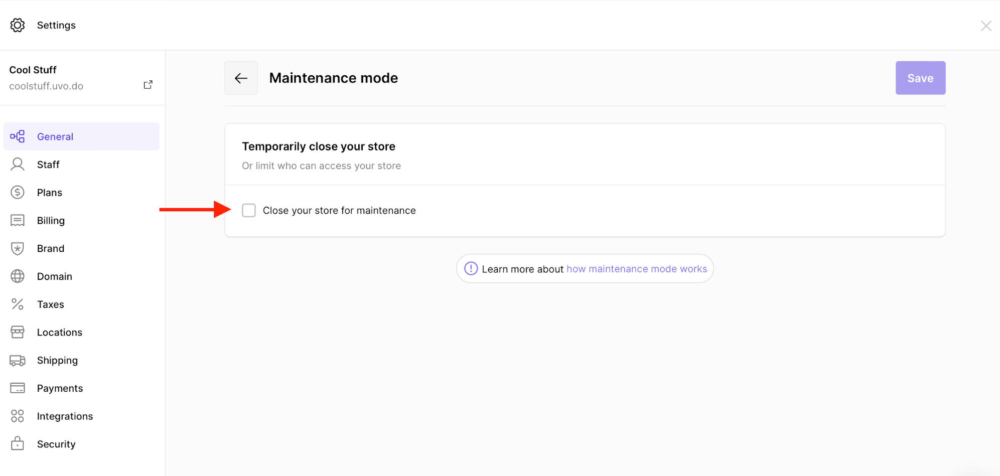

# Store Settings

General settings can be found in

***Settings* → *General***

## Store Name, Email, Description

***Settings* → *General* → *Store name, email, description***

Here, you can update your store name, contact email and store description.

Store description is displayed at the footer area of your eCommerce store.

## Store Address

***Settings* → *General* → *Address***

Your store address appears in your invoices.

## Timezone, Currency, Units of Measurement

***Settings* → *General* → *Standards and formats***

This information is used to calculate product prices, shipping weights, order times, shipping rates at checkout and label prices during fulfillment.

You can not change the currency when you've already received an order. Learn more about [setting a currency for your online store](../store-setup/store-domain/setting-up-currency).

## Account

***Settings* → *General* → *Account***

Here, you can edit your admin dashboard profile and change your email.

To update your email address, click on the **Change email** hyperlink.

Here, write down your new address and password. You should receive a verification email.

## Language

***Settings* → *General* → *Language***

You can change both admin dashboard and storefront language.

## Social Profiles

***Settings* → *General* → *Social profiles***

## Maintenance Mode & Store Access Restriction

***Settings* → *General* → *Maintenance mode***

Here, tick the box to enable the maintenance mode.

After enabling the maintenance mode for your online store, you can give an access by creating a password.

- Learn more about the [maintenance mode and use cases](maintenance-mode).

After ticking the box, write down the password:

## Customizing Your Store Settings

Customizing your store settings is an important part of creating a professional and effective online presence. Here are some best practices to consider when configuring your general store settings:

### Store Name and Branding

- **Choose a Memorable Name**: Select a store name that's easy to remember, relevant to your products, and reflects your brand identity.
- **Consistent Branding**: Ensure your store name, logo, and overall visual identity are consistent across all customer touchpoints.
- **Professional Email**: Use a business email address (e.g., contact@yourstorename.com) rather than a personal email address.
- **Compelling Description**: Write a concise yet informative store description that communicates your value proposition.

### Location and Timezone Settings

- **Accurate Address**: Provide your complete and accurate business address for legal and tax purposes.
- **Correct Timezone**: Set the appropriate timezone to ensure order timestamps and scheduled operations occur at the intended times.
- **Currency Selection**: Choose the currency most relevant to your primary market.
- **Measurement Units**: Select the units of measurement (metric or imperial) that your target customers are most familiar with.

### Language and Accessibility

- **Target Audience Language**: Set your primary language based on your target market's preferences.
- **Consider Multiple Languages**: If serving diverse markets, consider enabling multiple languages for broader accessibility.
- **Clear Communication**: Use simple, straightforward language in all store communications.

### Maintenance and Security

- **Planned Maintenance**: Schedule maintenance during low-traffic periods to minimize disruption.
- **Password Protection**: When in maintenance mode, use strong passwords to restrict access.
- **Regular Updates**: Periodically review and update your store settings to ensure they remain relevant and effective.

By carefully configuring these general settings, you create a foundation for a professional, user-friendly online store that aligns with your business goals and meets your customers' expectations.
