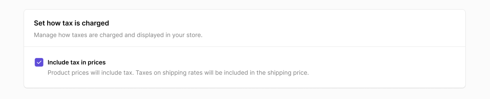

# Introduction to Tax Rates

A tax rate refers to the percentage of a customer's purchase that must be paid to the government as a form of taxation. Tax rates are assigned to a product or groups of products and orders for calculations.

Many countries have varying tax systems that determine the sales tax charged based on the destination of an order. This means that the tax rate applied to a product depends on the specific region where it is delivered. At eCommerce, sellers can apply **location-based tax rates** - tax rates that are based on the buyer's location.

eCommerce makes it easy for sellers to create and manage tax rates for their eCommerce store. By setting up tax rates, you can ensure that your customers are charged the correct amount of tax for their orders, while also remaining in compliance with local and national tax regulations.

:::note
eCommerce is not responsible for filing or submitting your sales taxes on your behalf.
:::

## Include Taxes in Product Prices

It's essential for sellers to understand the specific tax regulations of each country they operate in to determine whether to include tax in the product price.

The inclusion of tax in the product price varies from country to country. Some countries have adopted a system where the value-added tax (VAT) is included in the displayed price, while others do not.

Australia, Japan, and countries in the European Union (EU) generally require VAT-inclusive pricing, where the displayed price already includes the applicable VAT.

However, in countries like the United States and Canada, taxes are typically added at the checkout (point of sale) and are not included in the listed price.

eCommerce allows you to display product prices with the VAT included. To enable this feature, on the ***Settings* → *Taxes*** page, scroll down and tick the box for **"Include tax in prices"**.

When you enable the **"Include tax in prices"** option, total sales amount displayed during the checkout tend to have inconsistent price endings. To adjust the total price of goods to a more standardized value, you can use **price rounding** feature.

Learn more about [how price rounding works and how to enable it](../products/price-rounding).

## Example Cases for the Inclusion and Exclusion of Taxes

The inclusion or exclusion of taxes in the product price depends on various factors, including regional or national tax regulations and the business practices of the eCommerce platform or seller.

In some countries, it is mandatory to include taxes in the displayed price, while in others, it may be optional. Additionally, certain types of products may be exempt from certain taxes or have different tax rates, which can influence whether taxes are included or excluded from the displayed price.

The purpose of including or excluding taxes in the product price is to provide transparency and clarity to customers regarding the actual cost they will pay for a product. Including taxes in the displayed price upfront simplifies the purchasing process for customers, as they know the exact amount they will be charged. Excluding taxes allows for flexibility in adjusting the displayed price based on different tax rates or exemptions, but it requires customers to calculate and be aware of the additional tax amount they need to pay.

Let's take an example.

Here is the scenario. Let's say your business is based in Denmark that sells a product for €20. As a Danish store, you charge tax rate of 25% to customers in Denmark. However, customers from US are not subject to the EU taxes, and therefore, the tax rate for them is 0%.

Now, with this scenario laid out, let's look at the 3 main configurations, their differences, and how they impact the way tax is charged on our products.

### Case #1. Product Prices Exclude Tax

Having tax excluded from product prices means that your eCommerce store will display them without tax.

In this case, customers from Denmark will pay total €25 at the checkout: €20 for the product and 25% tax of €5. However, the customer from the US will pay only €20 for the product without an additional tax.

This approach is in line with accounting legislation in many countries where VAT or GST is charged and allows you to choose which customers to charge tax to.

You can also use this feature to charge tax to some customers, but not to others, like VAT-exempt business customers in the European Union or customers with disabilities or indigenous backgrounds.

### Case #2. Product Prices Include Tax

Using the same example of a product priced at €20, with the Danish tax percentage of 25%, we will calculate the final prices for both Danish and US customers.

In this case both Danish and US customers will pay the same price of €20. The Danish customer pays €16 for the product and €4 for tax, while the US customer pays €20 for the product. Since the US is not subject to Danish taxes, the entire €20 goes towards the product price. There won't be any additional tax charged to the US customer but the customer ends up paying more for the same product than the Danish customer.

Having prices include tax offers certain advantages. It allows your eCommerce store to display the final price, which is particularly useful when selling primarily to consumers. It simplifies the shopping experience by providing transparency and clarity on the total cost customers need to pay.

Additionally, in some countries, legislation may require you to display tax-inclusive pricing. This setup ensures compliance with such regulations and eliminates any confusion or surprises for your customers during the checkout process.

However, it's important to note that this pricing option may not be ideal for online stores that need to VAT-exempt customers, particularly businesses. If your primary customer base consists of businesses or you need to offer VAT-exempt pricing, then this setup may not be the best option for your eCommerce store.

**Consider Your Audience and Requirements:** When deciding which pricing option is best for your eCommerce store, it's crucial to consider your target audience and any specific requirements you have. If you primarily sell to consumers and want to provide transparent pricing, including tax may be the right choice. On the other hand, if you need to accommodate VAT-exempt customers, such as businesses, this setup may not meet your needs.

We recommend evaluating your customer base, consulting with a registered tax consultant, and considering the specific legislation in your country to make an informed decision that aligns with your business goals and requirements.

### Case #3 Product Price Inclusion and Exclusion is Based on the Customer's Location

For a customer from Denmark, Danish would pay €16 for the product plus €4 for tax. This means the customer will pay a total of €20 for the product, which includes the €4 tax.

On the other hand, if a customer from the United States purchases the same product, they will only pay €16 for the product. There won't be any additional tax charged since the US is not subject to Danish taxes.

This pricing setup provides several advantages. Firstly, it ensures that customers only pay taxes when necessary, avoiding any unnecessary costs. Secondly, it allows your store to accurately calculate and selectively charge taxes based on the customer's location, complying with local tax regulations.

Furthermore, you can display prices with taxes included while still being able to exempt certain customers from VAT. For instance, businesses may be eligible for VAT exemption, or you may choose not to charge tax on products for customers with disabilities or those with indigenous backgrounds.

Deciding which pricing option is best for your eCommerce store can be a complex task. We strongly recommend consulting a registered tax consultant to ensure you make the right choice for your business. They can provide valuable advice based on your specific circumstances and local tax regulations.

**VAT calculation formula** for VAT exclusion is the following: to calculate VAT having the gross amount you should divide the gross amount (product price) by 1 + VAT percentage (i.e. if it is 25%, then you should divide by 1.25).

Calculate your VAT online here: [vatcalconline.com](https://vatcalconline.com/).

## How to Create a Tax Rate?

- On your eCommerce admin panel, navigate to the ***Settings* → *Taxes*** section of your dashboard.

- Click "**Create tax rate**" to begin setting up a new tax rate.

- **Name the tax rate** which will appear on the checkout page.

- Then, **select the country** for which you want to create a tax rate.

- Enter the tax rate for the country. This should be a percentage that will be added to the total cost of the customer's order. And, you can charge the tax percentage based on either ***Products*** or ***Products and shipping***.

  - charge taxes *based on products*: if you want to exclude shipping from taxation.

  - charge taxes based on *products and shipping*: if you want to include shipping in the taxable amount.

- Click "**Save**" to create the tax rate.

Note that tax regulations may vary between countries, and some may consider shipping as taxable, while others may not. By default, shipping is taxed, but you have the flexibility to customize your tax rates to suit your requirements. If you prefer to charge taxes exclusively on your products, you can modify the settings by changing the **Charge taxes on** option from ***Products and shipping*** to ***Products*** only for cases where shipping shouldn't be taxed.

Once you've set up your tax rates, eCommerce will automatically calculate the appropriate tax amount for each customer order based on their location and the tax rules you've set up. This ensures that your customers are charged the correct tax amount, and that you are in compliance with tax regulations for the countries where you do business.

:::caution
If no tax rate created, customers won't be able to complete the checkout.
:::
